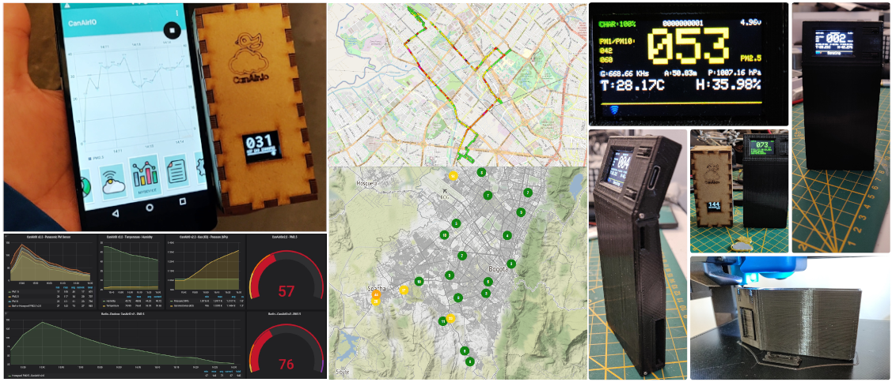

<!--
**hpsaturn/hpsaturn** is a ✨ _special_ ✨ repository because its `README.md` (this file) appears on your GitHub profile.

Here are some ideas to get you started:

- 🔭 I’m currently working on ...
- 🌱 I’m currently learning ...
- 👯 I’m looking to collaborate on ...
- 🤔 I’m looking for help with ...
- 💬 Ask me about ...
- 📫 How to reach me: ...
- 😄 Pronouns: ...
- ⚡ Fun fact: ...
-->

## Some useful links:

- 💬 [Hpsaturn](https://hpsaturn.com)
- 👨 [CanAirIO](https://canair.io)
- 🤔 [Twitter](https://twitter.com/hpsaturn)
- 🔭 [Linkedin](https://www.linkedin.com/in/hpsaturn/)
- 📫 [YouTube](https://www.youtube.com/user/hpsaturn)

## Open Source projects I work on 👇🏻
